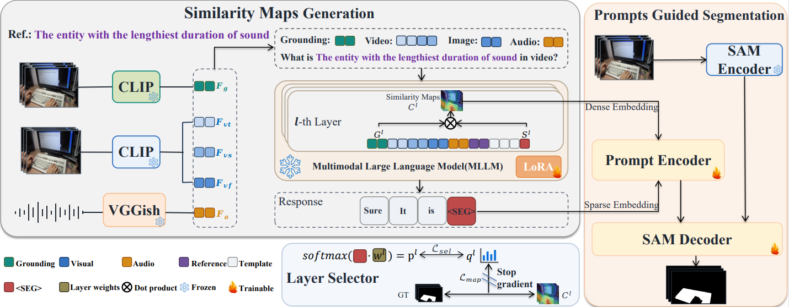

# ALS3P: Adaptive Layer Selection and Semantic-Spatial Prompting for Referring Audio-Visual Segmentation




Referring Audio-Visual Segmentation (Ref-AVS) aims to segment an object specified by a natural language expression with visual and acoustic cues. Recent methods use multimodal large language models (MLLMs) to obtain compact semantic representation of the referred object but lack explicit frame-wise spatial evidence. Moreover, the final MLLM layer may not provide suitable semantic-spatial localization, as different layers exhibit distinct semantic-spatial correspondence. To address these limitations, we propose ALS3P, an adaptive layer selection and semantic-spatial prompting framework. ALS3P augments the MLLM with frame-wise grounding representation and adaptively selects the hidden layer that better captures target semantic with spatial evidence. The selected semantic and grounding representations are used to construct complementary semantic and spatial prompts to guide the Segment Anything Model(SAM).  On Ref-AVSBench, ALS3P achieves 80.0% and 81.7% J&F on the Seen and Unseen splits, surpassing the best prior results by 3.3 and 4.8 points, respectively. 

---

## ⚙️ Setup

### Dataset

Download the official [Ref-AVSBench dataset](https://github.com/GeWu-Lab/Ref-AVS):

```text
REFAVS/
├── metadata.csv
├── media/
├── gt_mask/
├── audio_embed/
└── image_embed/
  
```

The last two directories contain pre-extracted **VGGish audio features** and **SAM image embeddings**:

```python
python save_audio_feats.py --data_dir 'path/to/data'
python save_sam_feats.py  --data_dir 'path/to/data'
```

### Dependencies

Install PyTorch for your CUDA environment, then install the dependencies:

```bash
pip install -r requirements.txt
```

---

## 📌 Getting Started

### Train

```bash
python train_ALS3P.py \
  --name ALS3P \
  --gpu_id 0 \
  --data_dir /path/to/REFAVS \
  --vision_pretrained /path/to/sam_vit_h_4b8939.pth \
  --vision_tower /path/to/clip-vit-large-patch14 \
  --mllm /path/to/Chat-UniVi-7B-v1.5 \
  --checkpoint_root checkpoints \
  --log_root log
```

### Evaluate

```bash
python infer_ALS3P.py \
  --gpu_id 0 \
  --data_dir /path/to/REFAVS \
  --vision_pretrained /path/to/sam_vit_h_4b8939.pth \
  --vision_tower /path/to/clip-vit-large-patch14 \
  --mllm /path/to/Chat-UniVi-7B-v1.5 \
  --saved_model checkpoints/ALS3P_best_val.pth \
  --visualization_root visualization \
```

## 🧩 Key files

```text
train_ALS3P.py                     Training
infer_ALS3P.py                     Checkpoint evaluation
configs/config_ALS3P.py            Training arguments
configs/config_infer_ALS3P.py      Evaluation arguments
datasets/dataset_refavs_ALS3P.py   Ref-AVSBench loader and grounding preprocessing
models/ALS3P.py                    Main model and losses
models/ALS3P_layer_selector.py     Adaptive layer selector
models/ALS3P_prompts.py            Similarity maps and SAM prompts
ChatUniVi/model/arch_ALS3P.py      Grounding representation in the MLLM
```


